# Лабораторная работа №9 — Git

---

___

## **Оценка 3**

1. **Инициализация и проверка состояния**  
   
   > Команда показывает текущее состояние рабочей директории. На этом этапе репозиторий чист.

2. **Просмотр истории коммитов**  
   
   > История коммитов пуста, так как это новый репозиторий.

3. **Создание файла с кодом**  
   
   > Создание файла с функцией сортировки (пузырьковая сортировка).

4. **Проверка состояния после создания файла**  
   
   > Файл не появился в списке, так как не выполнена команда git add.

5. **Добавление файла в staging area**  
   
   > Команда добавляет файл в область подготовки (staging area).

6. **Проверка состояния после добавления**  
   
   > Теперь файл находится в "Changes to be committed" - готов к коммиту.

7. **Фиксация изменений**  
   
   > Фиксация изменений с описательным сообщением.

8. **Проверка чистоты рабочей директории**  
   
   > Рабочая директория чиста - все изменения зафиксированы.

9. **Добавление комментария к коду**  
   
   > Добавляем комментарий к коду для документации.

10. **Обнаружение изменений Git**  
    
    > Git обнаружил изменения в файле, но они еще не проиндексированы.

11. **Добавление изменений в staging area**  
    
    > Добавляем изменения в staging area.

12. **Подготовка к коммиту**  
    
    > Изменения готовы для коммит.

13. **Добавление второго комментария**  
    
    > Добавляем второй комментарий.

14. **Фиксация второго набора изменений**  
    
    > Фиксация второго набора изменений.

15. **Проверка состояния и истории**  
    
    > Проверяем состояние и смотрим историю.

16. **Завершение работы с файлом sort.c**  
    
    > Завершаем работу с файлом sort.c.

17. **Синхронизация с удаленным репозиторием**  
    
    > Синхронизация локальных изменений с удаленным репозиторием.

18. **Создание ветки**  
    
    > Создание ветки "mybranch" для изолированной разработки.

19. **Переход на созданную ветку**  
    
    > Переход на созданную ветку для работы в ней.

20. **Сравнение статуса в ветках**  
    
    > Показывает, что статус одинаков в обеих ветках до внесения изменений.

21. **Создание файла в ветке mybranch**  
    
    > Создание файла с именем пользователя в ветке mybranch.

22. **Фиксация изменений в ветке mybranch**  
    
    > Фиксация изменений в ветке mybranch.

23. **Визуализация истории коммитов**  
    
    > Визуализация истории коммитов с отображением ветвления.

24. **Переключение обратно на master**  
    
    > Переключение обратно на основную ветку master.

25. **Создание отдельного файла в master**  
    
    > Создание отдельного файла в ветке master, чтобы показать различия.

26. **Отображение истории всех веток**  
    
    > Отображение истории всех веток, показывает расхождение master и mybranch.

27. **Проверка файлов в ветках**  
    
    > В ветке mybranch есть file1.txt, но нет file2.txt (который создан в master).

28. **Показать различия между ветками**  
    
    > Показывает различия между ветками - какие файлы и изменения есть в одной ветке, но нет в другой.

29. **Пушим mybranch на GitHub**  
    
    > Пушим mybranch и проверяем его на GitHub.

---

## **Оценка 4**

1. **Переход на ветку mybranch**  
   
   > Переход на ветку mybranch для продолжения работы.

2. **Добавление функции main() в sort.c**  
   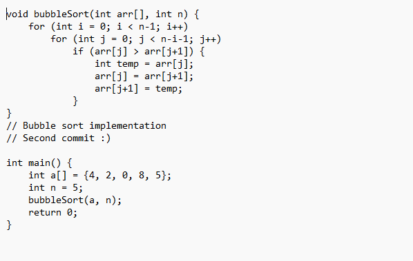
   > Добавление функции main() в файл sort.c для тестирования сортировки.

3. **Показать незаиндексированные изменения**  
   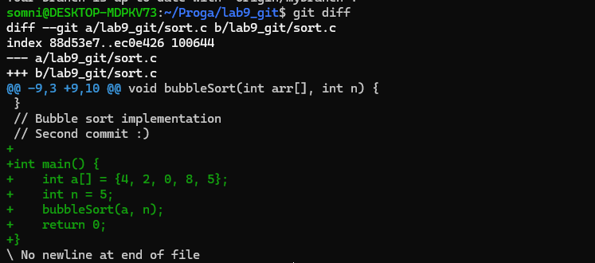
   > Команда показывает все незаиндексированные изменения в файле sort.c.

4. **Проверка staged области**  
   
   > В staged области пока нет изменений (пусто).

5. **Индексация изменений файла sort.c**  
   
   > Индексация изменений файла sort.c.

6. **Проверка изменений после add**  
   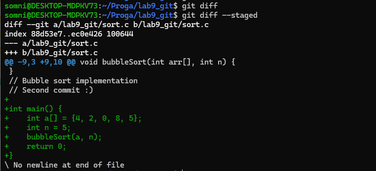
   > После add изменения перешли в staged, поэтому git diff пуст, а git diff --staged показывает изменения.

7. **Изменение массива в функции main()**  
   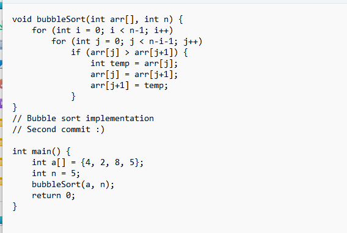
   > Изменение массива в функции main() - удаление одного элемента.

8. **Показать изменения после правки**  
   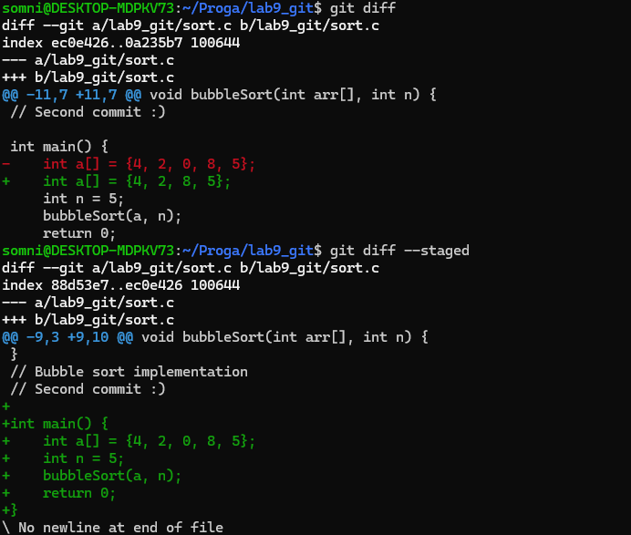
   > Теперь есть изменения и в staged (старые), и в unstaged (новые).

9. **Статус файла sort.c**  
   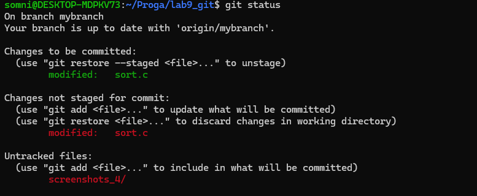
   > Файл sort.c отображается дважды: в Changes to be committed и Changes not staged for commit.

10. **Удаление файла из staging area**  
    
    > Удаление файла из staging area (отмена git add).

11. **Статус после восстановления**  
    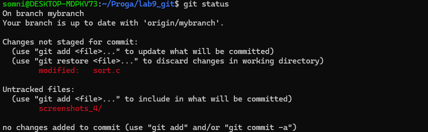
    > Теперь все изменения только в unstaged области.

12. **Фиксация текущих изменений**  
    
    > Фиксация всех текущих изменений в файле sort.c.

13. **История коммитов после изменений**  
    
    > История коммитов после внесения изменений.

14. **Добавление вывода в консоль**  
    
    > Добавление вывода сообщения в консоль.

15. **Проверка содержимого файла**  
    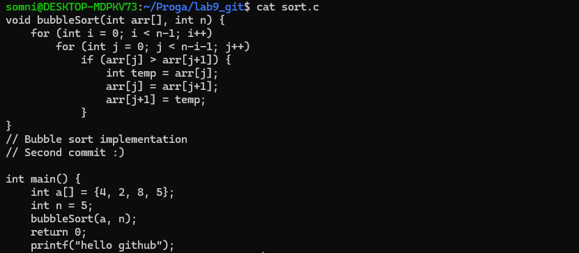
    > Проверка, что printf добавлен правильно.

16. **Обнаружение нового изменения**  
    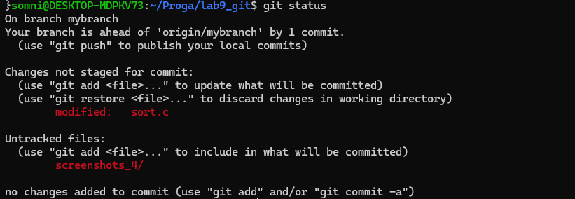
    > Git обнаружил новое изменение в файле.

17. **Восстановление файла до последнего коммита**  
    
    > Восстановление файла до состояния последнего коммита.

18. **Проверка после восстановления**  
    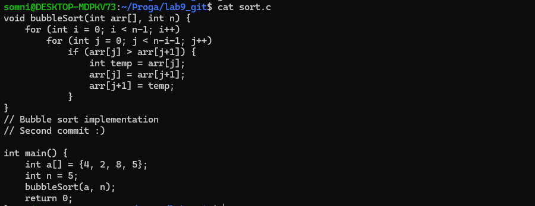
    > Убеждаемся, что printf удален из файла.

19. **Рабочая директория снова чиста**  
    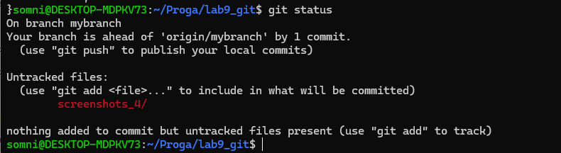
    > Рабочая директория снова чиста после восстановления файла.

20. **Отправка обновленной ветки mybranch**  
    
    > Отправка обновленной ветки mybranch на удаленный репозиторий.

21. **Создание нового файла в master**  
    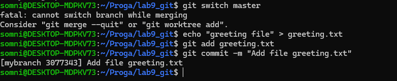
    > Создание нового файла в ветке master.

22. **Добавление текста в файл greeting.txt**  
    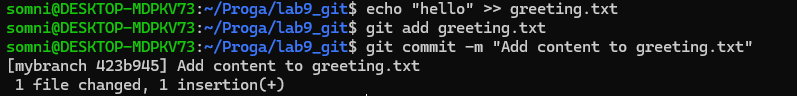
    > Добавление текста в файл greeting.txt.

23. **Создание новой ветки feature/uppercase**  
    
    > Создание новой ветки с соглашением feature/* для изолированной разработки.

24. **Статус Git в новой ветке**  
    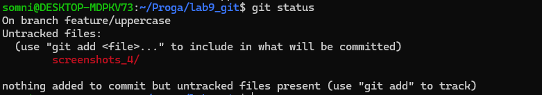
    > Статус Git в новой ветке feature/uppercase.

25. **Изменение текста на верхний регистр**  
    
    > Изменение текста в файле на верхний регистр (HELLO).

26. **Коммит изменений в ветке feature/uppercase**  
    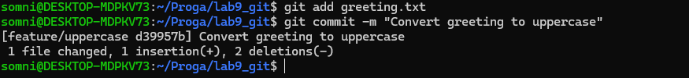
    > Коммит изменений в ветке feature/uppercase.

27. **Список всех локальных веток**  
    
    > Список всех локальных веток в репозитории.

28. **Графическое представление истории всех веток**  
    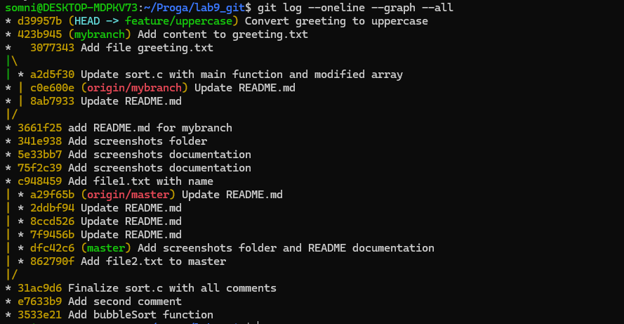
    > Графическое представление истории всех веток.

29. **Возврат на основную ветку master**  
    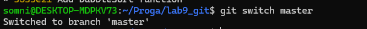
    > Возврат на основную ветку master для слияния.

30. **Проверка содержимого файла в master**  
    
    > Проверка содержимого файла greeting.txt в ветке master.

31. **Сравнение различий между ветками**  
    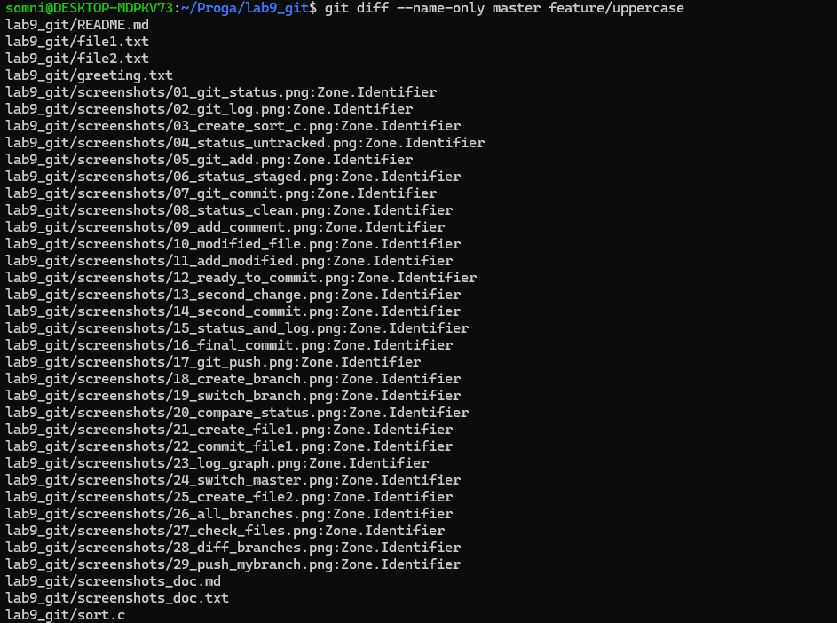
    > Сравнение различий между ветками master и feature/uppercase.

32. **Выполнение слияния веток**  
    
    > Выполнение слияния ветки feature/uppercase в master.

33. **Проверка содержимого файла после слияния**  
    
    > Проверка содержимого файла после успешного слияния.

34. **Удаление ненужной ветки**  
    
    > Удаление ненужной ветки feature/uppercase после слияния.

35. **Слияние ветки mybranch в master**  
    
    > Слияние ветки mybranch в основную ветку master.

36. **История коммитов после всех операций слияния**  
    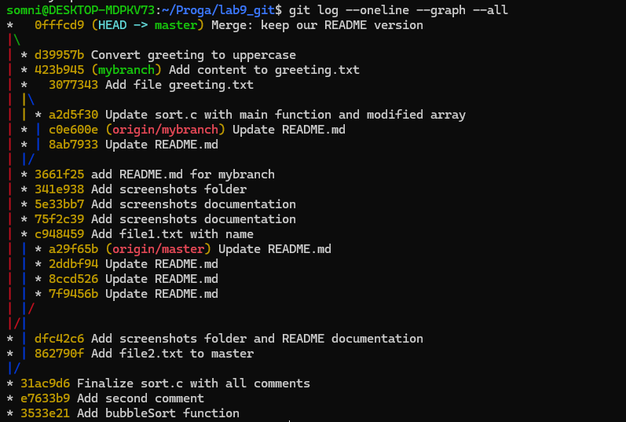
    > История коммитов после всех операций слияния.

37. **Отправка обновленной ветки master**  
    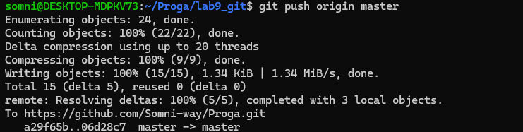
    > Отправка обновленной основной ветки master на удаленный репозиторий.

---

## **Оценка 5**

### **Конфликты с файлом file.txt**

1. **Создание новой ветки branch1**  
   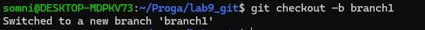
   > Создание новой ветки branch1.

2. **Создание файла file.txt в ветке branch1**  
   
   > Создание файла file.txt в ветке branch1 со строкой "This is a relevant fact".

3. **Фиксация изменений в ветке branch1**  
   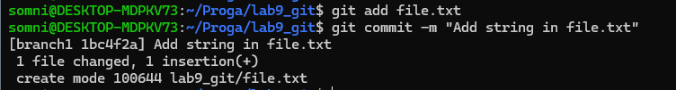
   > Фиксация изменений в ветке branch1 при помощи коммита.

4. **Создание конфликтующего изменения в master**  
   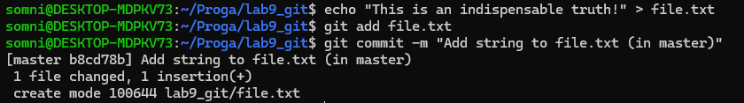
   > Создание конфликтующего изменения в основной ветке master - тот же файл file.txt получает другое содержимое.

5. **Просмотр истории коммитов перед слиянием**  
   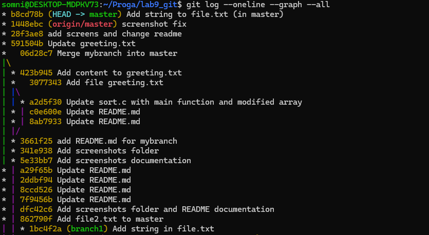
   > Просмотр истории коммитов - видны расходящиеся ветки master и branch1.

6. **Попытка слияния приводит к конфликту**  
   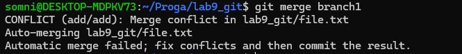
   > Попытка слияния ветки branch1 в master приводит к конфликту - Git не может автоматически определить, какую версию файла оставить.

7. **Статус Git показывает конфликт**  
   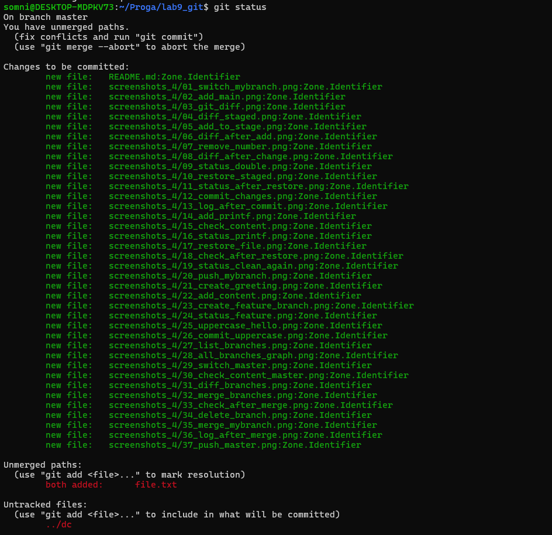
   > Статус Git показывает файл file.txt в состоянии конфликта - требуется ручное разрешение.

8. **Ручное редактирование файла для разрешения конфликта**  
   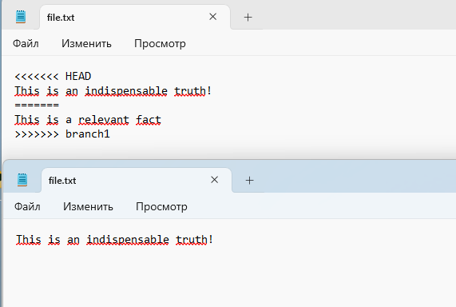
   > Ручное редактирование файла file.txt для разрешения конфликта - удаление маркеров и оставление единственной версии.

9. **Фиксация разрешенного конфликта**  
   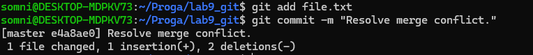
   > Фиксация разрешенного конфликта при помощи коммита.

10. **Просмотр истории после разрешения конфликта**  
    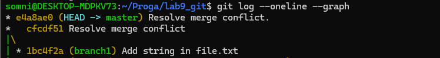
    > Просмотр истории после успешного разрешения конфликта - видно слияние веток с созданием merge коммита.

11. **Отправка обновленной ветки master**  
    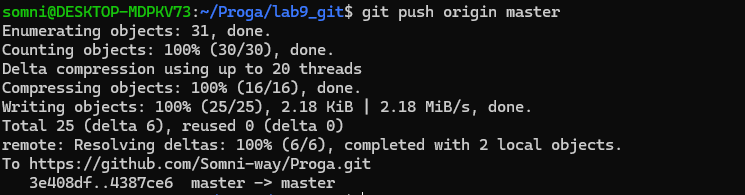
    > Отправка обновленной ветки master на удаленный репозиторий.

### **Конфликты с mergesort.py**

12. **Создание базовой версии файла mergesort.py**  
    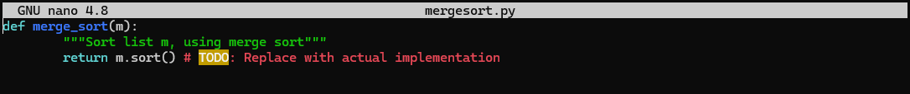
    > Создание базовой версии файла mergesort.py с заглушкой.

13. **Фиксация базовой реализации в master**  
    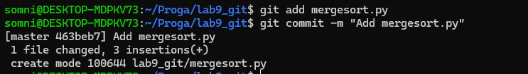
    > Фиксация базовой реализации в основной ветке master.

14. **Создание отдельной ветки Mergesort-Impl**  
    
    > Создание отдельной ветки Mergesort-Impl.

15. **Реализация сортировки слиянием - версия "righty"**  
    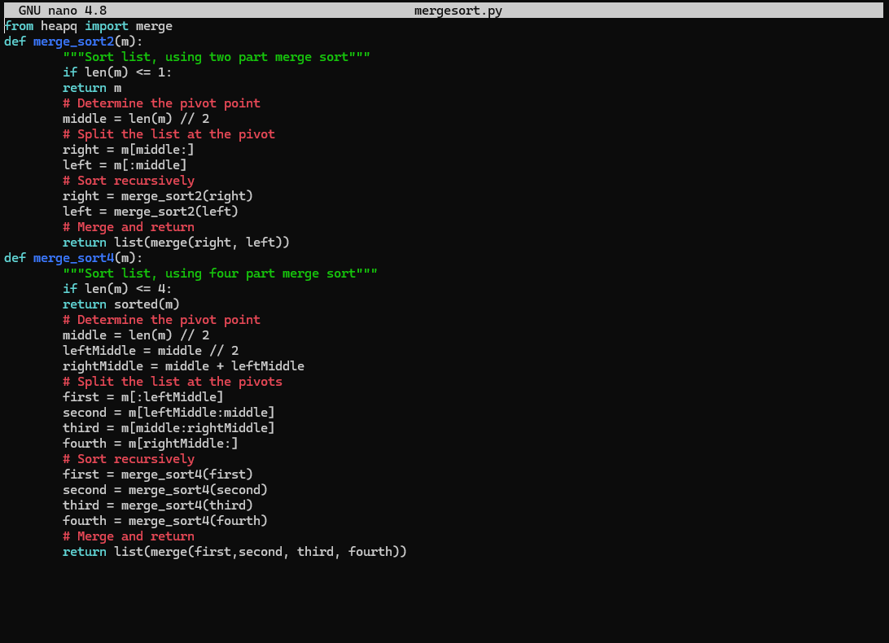
    > Реализация сортировки слиянием в ветке Mergesort-Impl - версия "righty".

16. **Фиксация "righty" в ветке Mergesort-Impl**  
    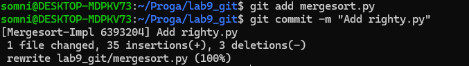
    > Фиксация "righty" в ветке Mergesort-Impl.

17. **Альтернативная реализация сортировки - "lefty"**  
    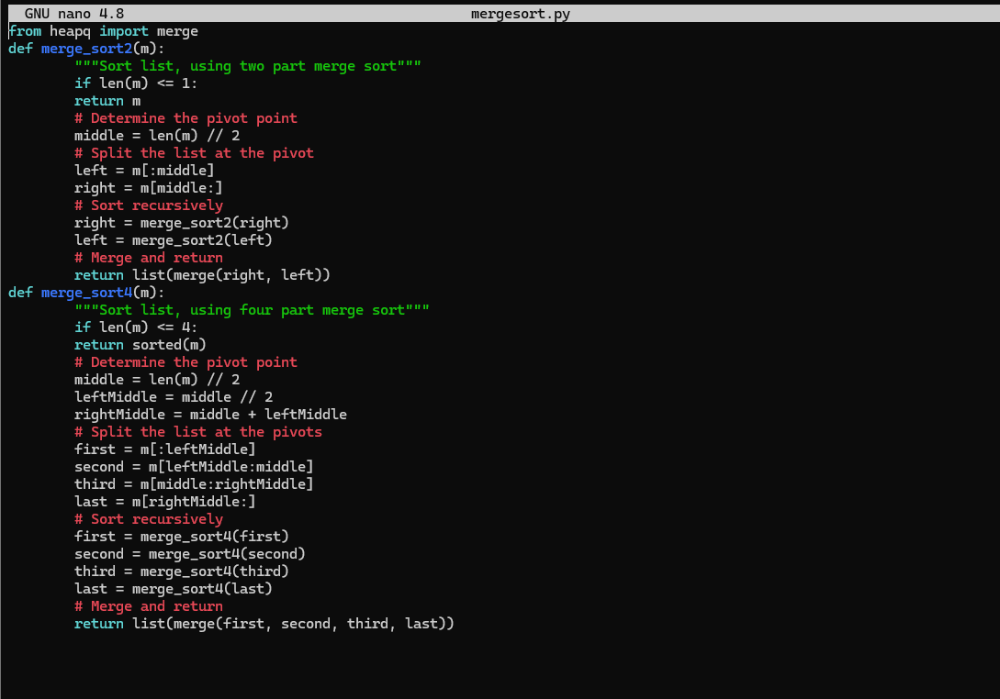
    > Альтернативная реализация сортировки - "lefty" в основной ветке master.

18. **Фиксация "lefty" в ветке master**  
    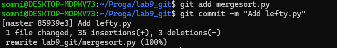
    > Фиксация "lefty" в ветке master.

19. **Просмотр истории перед слиянием**  
    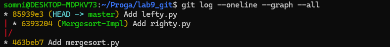
    > Просмотр истории перед слиянием - видны две ветки с разными кодами для сортировки.

20. **Попытка слияния приводит к сложному конфликту**  
    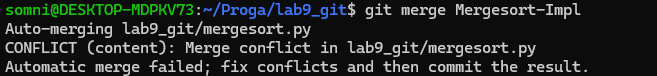
    > Попытка слияния ветки Mergesort-Impl в master приводит к сложному конфликту в коде Python.

21. **Ручное разрешение конфликта в mergesort.py**  
    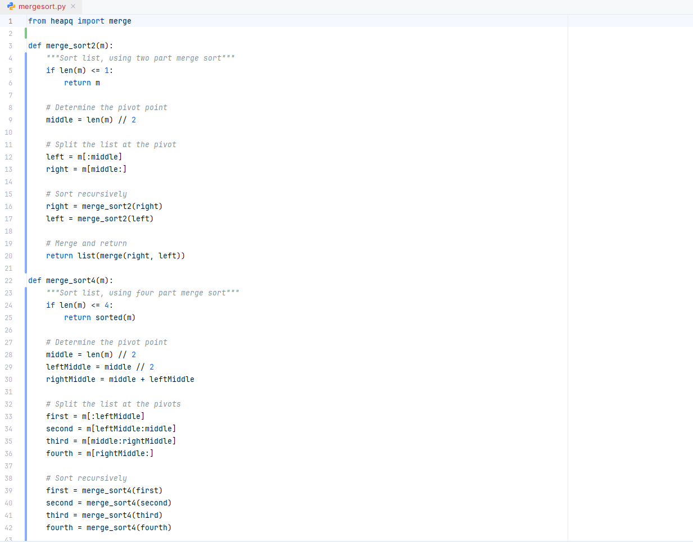
    > Ручное разрешение конфликта в файле mergesort.py.

22. **Финальный коммит после разрешения конфликтов**  
    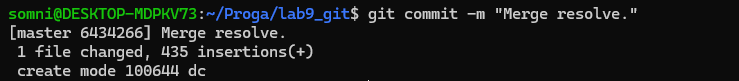
    > Финальный коммит после успешного разрешения всех конфликтов кода.
