# Лабораторная работа 9 – Git

Оценка 3:

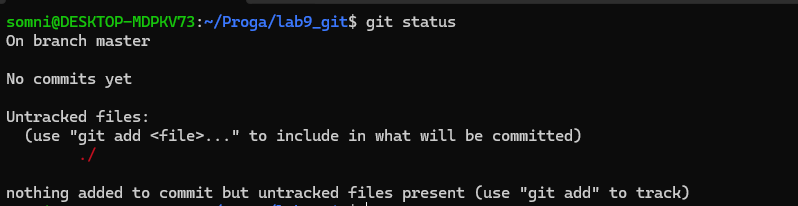

Команда показывает текущее состояние рабочей директории. На этом этапе репозиторий чист.

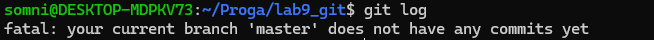

История коммитов пуста, так как это новый репозиторий.

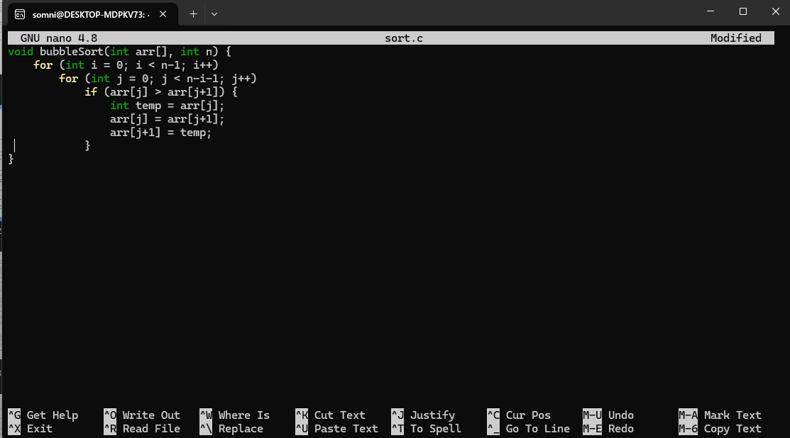

Создание файла с функцией сортировки (пузырьковая сортировка).

Файл не появился в списке, так как не выполнена команда git add.

Команда добавляет файл в область подготовки (staging area).

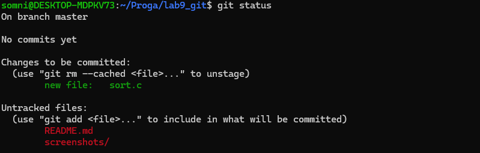

Теперь файл находится в "Changes to be committed" - готов к коммиту.

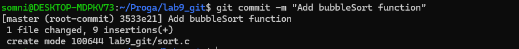

Фиксация изменений с описательным сообщением.

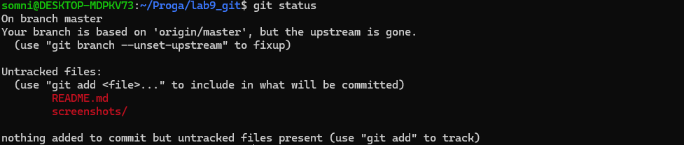

Рабочая директория чиста - все изменения зафиксированы.

Добавляем комментарий к коду для документации.

Git обнаружил изменения в файле, но они еще не проиндексированы.

Добавляем изменения в staging area.

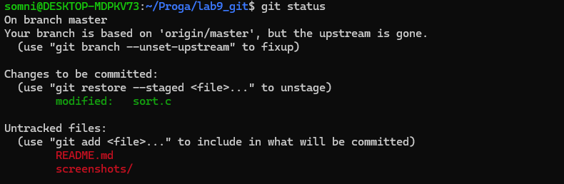

Изменения готовы для коммит.

Добавляем второй комментарий.

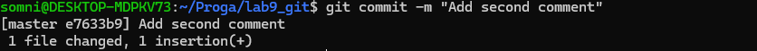

Фиксация второго набора изменений.

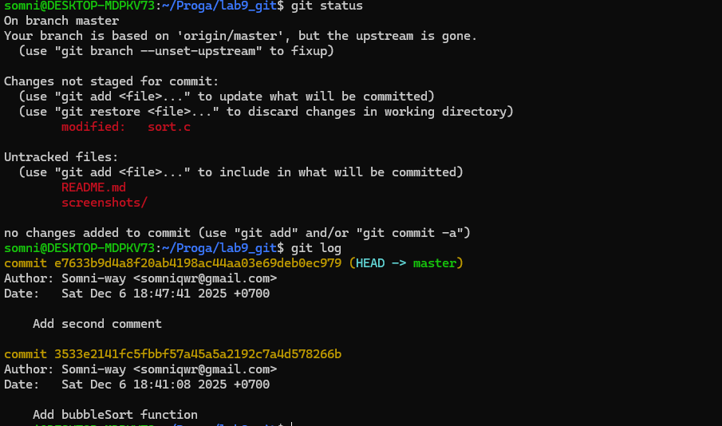

Проверяем состояние и смотрим историю.

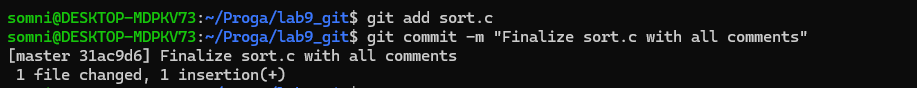

Завершаем работу с файлом sort.c.

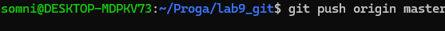

Синхронизация локальных изменений с удаленным репозиторием.

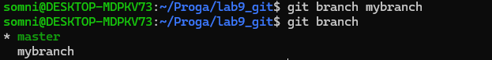

Создание ветки "mybranch" для изолированной разработки.

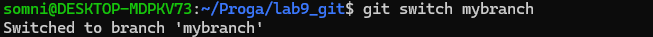

Переход на созданную ветку для работы в ней.

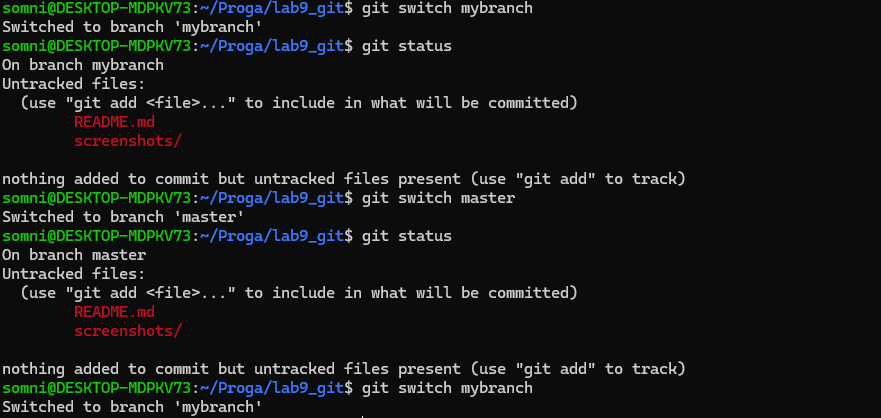

Показывает, что статус одинаков в обеих ветках до внесения изменений.

Создание файла с именем пользователя в ветке mybranch.

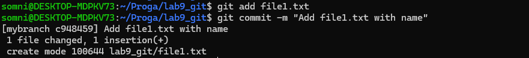

Фиксация изменений в ветке mybranch.

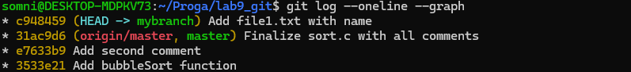

Визуализация истории коммитов с отображением ветвления.

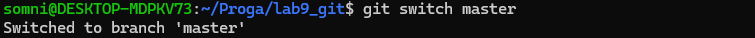

Переключение обратно на основную ветку master.

Создание отдельного файла в ветке master, чтобы показать различия.

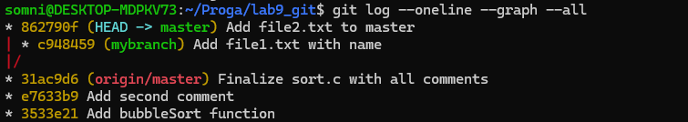

Отображение истории всех веток, показывает расхождение master и mybranch.

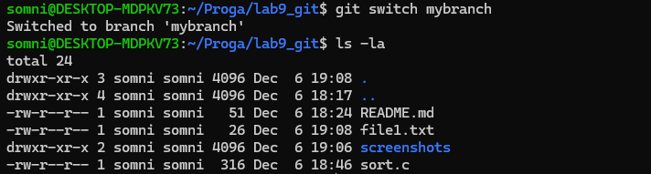

В ветке mybranch есть file1.txt, но нет file2.txt (который создан в master).

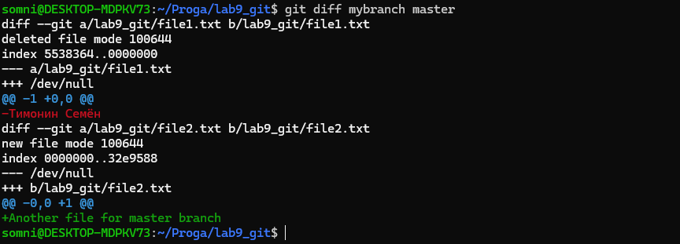

Показывает различия между ветками - какие файлы и изменения есть в одной ветке, но нет в другой.

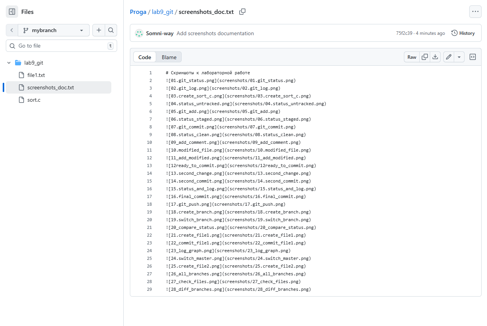

Пушим mybranch и проверяем его на GitHub.
